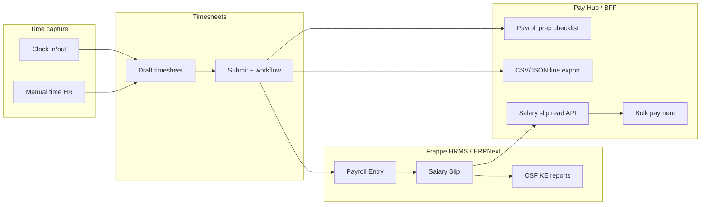

# CentyHR Kenya payroll (hybrid) — integration with time & attendance

**Purpose:** Merge the **CentyHR Kenya Payroll Compliance Engine** build spec (Frappe v15 + ERPNext + Frappe HRMS + Navari CSF KE, March 2026) with the **existing CentyHR product surface**: Pay Hub, CentyHR BFF, and **Timesheets / time & attendance** already implemented in this repo.

**Authoritative formulas & server provisioning** remain in your standalone compliance document (installation order, NSSF Phase 3 ceiling KES 108,000, SHIF 2.75% + min KES 300, AHL, PAYE on **taxable income** after NSSF+SHIF+AHL employee, component order, CSF KE reports, verification examples A/B/C). **This file does not replace that document** — it adds **product and API context** so engineering and ops know what runs where.

---

## 1. Architecture: three layers

| Layer | Responsibility | Kenya payroll pieces |
|--------|----------------|----------------------|
| **ERP site** (dedicated VPS; **not** Zimbra host) | Source of truth for salary structures, statutory components, Payroll Entry, Salary Slip, GL, **Navari CSF KE** reports (P9A, NSSF, SHIF, Housing Levy, bank advice, etc.) | All NSSF/SHIF/AHL/PAYE/NITA/HELB **formulas**, income tax slabs, payslip PDFs, compliance calendar |
| **CentyHR BFF** | Tenant-scoped API over Frappe REST; **no tax math** | Read/write HR docs; **timesheets**; **read-model** for Salary Slip / Payroll Entry (hybrid disbursement); optional triggers later |
| **Pay Hub** | UX for people, attendance, payroll prep, **CSV/JSON timesheet export**, future salary slip review, **bulk bank disbursement** | Presentation + export; bank file mapping from ERP net pay |

**Critical rule:** PAYE and statutory amounts are **always** computed inside Frappe HRMS with your configured salary structure — **never** recomputed in the BFF or Pay Hub for compliance purposes.

---

## 2. Time & attendance → payroll (data flow)

- **Today (implemented):** Employees/HR build **submitted** `Timesheet` rows from clock-out / manual time; Pay Hub **Payroll prep** surfaces draft vs submitted, **bulk submit**, **workflow actions** (if enabled on Timesheet), and **payroll export** (one row per `time_log`).
- **ERP linkage:** Whether hours flow into Payroll Entry depends on **your** salary structure / HRMS setup (e.g. timesheet-based earnings, or fixed + override). The compliance spec ensures **gross and deductions** on the slip are Kenya-correct once payroll runs — it does not automatically wire “every timesheet hour” without configuration in ERP.
- **Hybrid disbursement:** Use **ERP Salary Slip** as the **authority for net pay**; use Pay Hub **bulk disbursement** (existing product) to pay banks/M-Pesa from amounts derived from slips (via export from ERP, or future BFF-shaped CSV).

---

## 3. What we sprint in Cursor (repo) vs what we do on the bench

### In repo (CentyHR BFF + Pay Hub)

- **Done / ongoing:** Attendance routes, timesheet submit, payroll checklist, bulk submit, timesheet payroll export, workflow actions on Timesheet.
- **Sprint (this phase):** BFF **read-only** payroll endpoints: list/detail **Salary Slip** (and optionally **Payroll Entry**) by company + date range + employee — for Pay Hub “period review” and handoff to bank files (**no** PAYE logic in Node).
- **Next sprints:** Pay Hub UI tab “Salary slips” or merge with Payroll prep; map slip net pay → bulk payment template; optional **employee** payslip self-service read-only.

### On Linode / `bench` (your compliance spec)

- Provision **separate** VPS; install Frappe v15 → ERPNext → **hrms** → **navari_csf_ke** in that order.
- Create Company (KES), fiscal year, salary components in **mandatory order** (Basic → … → NSSF Employee → SHIF → AHL Employee → PAYE using **taxable income** = gross − NSSF − SHIF − AHL employee, etc.).
- Post-install verification: Examples A/B/C PAYE amounts, P9A / NSSF / SHIF reports, wkhtmltopdf payslips, backups, SSL.

---

## 4. Compliance crosswalk (spec §8 ↔ product)

| Spec checklist item | Product / ops note |
|---------------------|--------------------|
| CSF KE installed | Bench + site; BFF points at same site URL + API keys |
| Salary structure formulas | ERP only; order matches spec §4.6 |
| PAYE on taxable income | ERP only; **#1 gap** if using gross_pay in PAYE |
| Test Examples A/B/C | Run in ERP after structure save; Pay Hub does not replace this |
| P9A, NSSF, SHIF reports | Run in ERP (CSF KE); optionally deep-link from Pay Hub later |
| Bank payroll advice | ERP export; hybrid = same data feeds Pay Hub bulk file mapping |
| Timesheets submitted | Use Pay Hub **Payroll prep** + export before locking a payroll period |

---

## 5. Environment & governance

- **`TIMESHEET_WORKFLOW_TERMINAL_STATES`** (BFF): already used for timesheet workflow queue; unrelated to PAYE slabs — keep for approval UX only.
- **Statutory rate changes:** Follow spec §9 (Finance Act, NSSF ceiling, KRA P10/P9). Update **ERP formulas** first; BFF remains a thin API.
- **IP / positioning:** Kenya-accurate configuration on a **dedicated, tested** Frappe stack is the differentiated deliverable; Pay Hub extends visibility and bank payout workflow.

---

## 6. API reference (BFF) — payroll read-model

Added in CentyHR BFF (see `CentyHR/bff/src/routes/payroll.ts`):

- `GET /v1/payroll/salary-slips?from_date=&to_date=&employee=` — overlapping pay periods; HR lane (`canSubmitOnBehalf`).
- `GET /v1/payroll/salary-slips/:name` — full slip for review (earnings/deductions as returned by ERP).
- `GET /v1/payroll/payroll-entries?from_date=&to_date=` — payroll runs in range (optional integration aid).

All responses are **pass-through** from ERP; field availability depends on HRMS version and customization.

---

## 7. Change log

| Date | Change |
|------|--------|
| 2026-03 | Initial hybrid integration doc + BFF payroll read routes |
